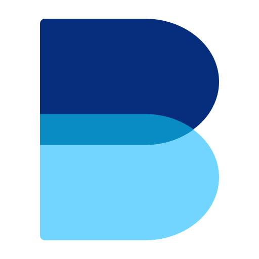

<a name="readme-top"></a>

<!-- PROJECT LOGO -->
<br />
<div align="center">
  <a href="https://www.birdle.art">
    
  </a>

  <h3 align="center">BIRDLE</h3>

  <p align="center">
    A fun Twitter-based game, and my entry to 2022 <a href="https://chirpdevchallenge.devpost.com/">Chirp Developer Challenge</a>
    <br />
    <a href="https://www.birdle.art"><strong>Go to game »</strong></a>
    <br />
    <br />
  </p>
</div>


<!-- TABLE OF CONTENTS -->
<details>
  <summary>Table of Contents</summary>
  <ol>
    <li>
      <a href="#about-birdle">About The Project</a>
    </li>
    <li>
      <a href="#built-with">Built With</a>
          </li>
              <li>
      <a href="#about-the-repo">About the repo</a>
      <ul>
        <li><a href="#backend">Backend</a></li>
        <li><a href="#frontend">Frontend</a></li>
        <li><a href="#admin">Admin</a></li>
      </ul>
    </li>
    </li>
  </ol>
</details>


<!-- ABOUT THE PROJECT -->
## About BIRDLE

<div align="center">
    
</div>

I got the idea for BIRDLE because I was getting a little bit dismayed at how negative my timeline was - particularly when it comes to news headlines.

Given the popularity of Wordle at the time, I thought it might be cool to make a similar type of daily guessing game, but where the thing to be guessed is a four-word *phrase*, with each word being taken from a popular tweet. The player is shown four tweets, and needs to guess the missing word from each, thus revealing the mystery phrase.

I wanted each daily phrase to be something nice and wholesome, something that would inspire you for the day. Positivity can be found anywhere if you look hard enough!

<p align="right">(<a href="#readme-top">back to top</a>)</p>


## Built With

* [![Typescript][Typescript]][Typescript-url]
* [![Storybook][Storybook]][Storybook-url]
* [![Next][Next.js]][Next-url]
* [![React][React.js]][React-url]
* [![Supabase][Supabase]][Supabase-url]

<p align="right">(<a href="#readme-top">back to top</a>)</p>


<!-- GETTING STARTED -->
## About the repo

### Backend

This `/backend` folder contains code for the cloud functions that run daily on Google Cloud Scheduler. It includes
- A `scrape` function to scrape the day's tweets from the allow-listed Twitter accounts
- A `solve` function to autogenerate a series of puzzle options. After this function runs I have an hour-long window to manually pick one of the options to serve as the day's puzzle, however, if I do not do this then it will automatically run an `autoPickPuzzle` function which will just grab the most suitable one.

The database that the app runs on is a Postgres instance hosted by Supabase.

### Frontend

The `/frontend` folder contains the main Next.js app. Try running;
```
cd frontend; npm i; npm run storybook
```
in order to view a locally hosted version of the app running on mocked data. This also features a few common user-journeys or "stories" that serve as the basis of the frontend e2e tests.

### Admin

This folder is `.gitignore`'d. However, I have an extra admin app that I can use for managing things like:
- the Twitter handles that can form the basis of the puzzles
- selection / overriding of the day's puzzle 
- adding / removing possible four-word phrases

<p align="right">(<a href="#readme-top">back to top</a>)</p>


<!-- MARKDOWN LINKS & IMAGES -->
<!-- https://www.markdownguide.org/basic-syntax/#reference-style-links -->
[contributors-shield]: https://img.shields.io/github/contributors/othneildrew/Best-README-Template.svg?style=for-the-badge
[contributors-url]: https://github.com/othneildrew/Best-README-Template/graphs/contributors
[forks-shield]: https://img.shields.io/github/forks/othneildrew/Best-README-Template.svg?style=for-the-badge
[forks-url]: https://github.com/othneildrew/Best-README-Template/network/members
[stars-shield]: https://img.shields.io/github/stars/othneildrew/Best-README-Template.svg?style=for-the-badge
[stars-url]: https://github.com/othneildrew/Best-README-Template/stargazers
[issues-shield]: https://img.shields.io/github/issues/othneildrew/Best-README-Template.svg?style=for-the-badge
[issues-url]: https://github.com/othneildrew/Best-README-Template/issues
[license-shield]: https://img.shields.io/github/license/othneildrew/Best-README-Template.svg?style=for-the-badge
[license-url]: https://github.com/othneildrew/Best-README-Template/blob/master/LICENSE.txt
[linkedin-shield]: https://img.shields.io/badge/-LinkedIn-black.svg?style=for-the-badge&logo=linkedin&colorB=555
[linkedin-url]: https://linkedin.com/in/othneildrew
[product-screenshot]: images/screenshot.png
[Next.js]: https://img.shields.io/badge/next.js-000000?style=for-the-badge&logo=nextdotjs&logoColor=white
[Next-url]: https://nextjs.org/
[Supabase-url]: https://supabase.com/
[React.js]: https://img.shields.io/badge/React-20232A?style=for-the-badge&logo=react&logoColor=white
[Supabase]: https://img.shields.io/badge/Supabase-181818?style=for-the-badge&logo=supabase&logoColor=white
[React-url]: https://reactjs.org/
[Typescript-url]: https://www.typescriptlang.org/
[Storybook-url]: https://storybook.js.org/
[Storybook]: https://img.shields.io/badge/storybook-181818?style=for-the-badge&logo=storybook&logoColor=white
[Typescript]: https://img.shields.io/badge/TypeScript-181818?style=for-the-badge&logo=typescript&logoColor=white
[Vue.js]: https://img.shields.io/badge/Vue.js-35495E?style=for-the-badge&logo=vuedotjs&logoColor=4FC08D
[Vue-url]: https://vuejs.org/
[Angular.io]: https://img.shields.io/badge/Angular-DD0031?style=for-the-badge&logo=angular&logoColor=white
[Angular-url]: https://angular.io/
[Svelte.dev]: https://img.shields.io/badge/Svelte-4A4A55?style=for-the-badge&logo=svelte&logoColor=FF3E00
[Svelte-url]: https://svelte.dev/
[Laravel.com]: https://img.shields.io/badge/Laravel-FF2D20?style=for-the-badge&logo=laravel&logoColor=white
[Laravel-url]: https://laravel.com
[Bootstrap.com]: https://img.shields.io/badge/Bootstrap-563D7C?style=for-the-badge&logo=bootstrap&logoColor=white
[Bootstrap-url]: https://getbootstrap.com
[JQuery.com]: https://img.shields.io/badge/jQuery-0769AD?style=for-the-badge&logo=jquery&logoColor=white
[JQuery-url]: https://jquery.com 